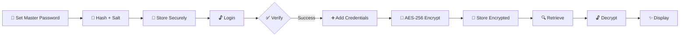

# <div align="center">🔒 **SECURE CLI PASSWORD MANAGER** 🔒</div>

<div align="center">


</div>

<div align="center">

```
 ██████╗ ██████╗ ██╗   ██╗██████╗ ████████╗ ██████╗     ███╗   ███╗ ██████╗ ██████╗ 
██╔════╝ ██╔══██╗╚██╗ ██╔╝██╔══██╗╚══██╔══╝██╔═══██╗    ████╗ ████║██╔════╝ ██╔══██╗
██║  ███╗██████╔╝ ╚████╔╝ ██████╔╝   ██║   ██║   ██║    ██╔████╔██║██║  ███╗██████╔╝
██║   ██║██╔══██╗  ╚██╔╝  ██╔═══╝    ██║   ██║   ██║    ██║╚██╔╝██║██║   ██║██╔══██╗
╚██████╔╝██║  ██║   ██║   ██║        ██║   ╚██████╔╝    ██║ ╚═╝ ██║╚██████╔╝██║  ██║
 ╚═════╝ ╚═╝  ╚═╝   ╚═╝   ╚═╝        ╚═╝    ╚═════╝     ╚═╝     ╚═╝ ╚═════╝ ╚═╝  ╚═╝
```

### 🎯 *Python CLI | AES Encryption | PBKDF2 Master Password*

[](https://github.com/YOUR_USERNAME)
[](LICENSE)

</div>

---

## 🚀 **FEATURES**

<table>
<tr>
<td width="50%">

### 🔑 **Master Password Protection**
```python
# PBKDF2 + Salt
# Secure Login System
# Military-Grade Hashing
```
**Status:** `[████████████] 100% SECURE`

</td>
<td width="50%">

### 🗄️ **Encrypted Storage**
```python
# AES-256 Encryption
# Individual Key Protection
# Zero Plaintext Storage
```
**Status:** `[████████████] 100% ENCRYPTED`

</td>
</tr>
<tr>
<td width="50%">

### 🎲 **Password Generator**
```python
# Strong Random Passwords
# Customizable Length
# Special Characters
```
**Status:** `[████████████] 100% RANDOM`

</td>
<td width="50%">

### 🖥️ **CLI Interface**
```python
# Fast & Lightweight
# Cross-Platform
# Local-Only Storage
```
**Status:** `[████████████] 100% OFFLINE`

</td>
</tr>
</table>

---

## 🛠️ **TECH STACK**

<div align="center">

| Technology | Purpose | Badge |
|:----------:|:-------:|:-----:|
|  | Core Language |  |
|  | Encryption Library |  |
|  | User Interface |  |
|  | Encryption Algorithm |  |

</div>

---

## 📝 **INSTALLATION**

```bash
# 🔻 STEP 1: Clone the repository
git clone https://github.com/YOUR_USERNAME/password-manager.git

# 🔻 STEP 2: Navigate to directory
cd password-manager

# 🔻 STEP 3: Create virtual environment
python3 -m venv venv

# 🔻 STEP 4: Activate virtual environment
source venv/bin/activate    # 🐧 Linux/MacOS
# venv\Scripts\activate     # 🪟 Windows

# 🔻 STEP 5: Install dependencies
pip install -r requirements.txt

# 🔻 STEP 6: Launch the application
python3 main.py

# ✅ READY TO SECURE YOUR PASSWORDS!
```

<div align="center">

```
[●●●●●●●●●●] 100% Installation Complete
```

</div>

---

## 📁 **PROJECT STRUCTURE**

```
password_manager/
│
├── 🎯 main.py              # CLI interface & entry point
├── 💾 storage.py           # File/database operations
├── 🔐 crypto_utils.py      # Encryption & hashing functions
├── 🎲 password_gen.py      # Random password generator
├── 📋 requirements.txt     # Python dependencies
└── 📖 README.md            # You are here!
```

<div align="center">

**[TOTAL FILES: 6]** | **[SECURITY LEVEL: MAXIMUM]** | **[THREAT LEVEL: ZERO]**

</div>

---

## 🔐 **SECURITY ARCHITECTURE**

<div align="center">

```
┌─────────────────────────────────────────────────────────────┐
│                     SECURITY LAYERS                         │
├─────────────────────────────────────────────────────────────┤
│  🔒 Layer 1: Master Password → PBKDF2 Hashing + Salt       │
│  🔒 Layer 2: Individual Credentials → AES-256 Encryption   │
│  🔒 Layer 3: Local Storage Only → No Cloud Exposure        │
│  🔒 Layer 4: Zero Plaintext → Everything Encrypted         │
│  🔒 Layer 5: Minimal Attack Surface → CLI Interface Only   │
└─────────────────────────────────────────────────────────────┘
```

</div>

### ⚠️ **Security Notes**

- ✅ **Master password hashed with PBKDF2 + salt**
- ✅ **All credentials encrypted using AES-256**
- ✅ **Local storage only, no cloud syncing**
- ✅ **Minimal attack surface, CLI-only interface**
- ✅ **No plaintext passwords ever stored**
- ✅ **Individual encryption per credential**

---

## 💻 **HOW IT WORKS**

<div align="center">



</div>

### 🎬 **Workflow**

1. **🔑 Setup** → Set master password → Hashed with PBKDF2 + salt
2. **🔓 Login** → Verify master password → Grant access
3. **➕ Add** → Input credentials → AES-256 encryption → Secure storage
4. **🔍 Retrieve** → Select credential → Decrypt after login → Display
5. **🎲 Generate** → Create strong random passwords → Copy & use

---

## 🎯 **USAGE EXAMPLE**

```bash
$ python3 main.py

╔════════════════════════════════════════╗
║   🔒 SECURE PASSWORD MANAGER 🔒       ║
╚════════════════════════════════════════╝

[1] 🔑 Login
[2] ➕ Add New Credential
[3] 🔍 View Credentials
[4] 🎲 Generate Password
[5] 🚪 Exit

Select option: _
```

---

## 🧑‍💻 **AUTHOR**

<div align="center">

### **Gautham Prasanth**

*Cybersecurity & Python Enthusiast*

[](https://github.com/YOUR_USERNAME)
[](https://linkedin.com/in/YOUR_PROFILE)
[](https://twitter.com/YOUR_HANDLE)

</div>

---

<div align="center">

### **Made with ❤️ & 🔒**

```
 ███████╗████████╗ █████╗ ██╗   ██╗    ███████╗███████╗ ██████╗██╗   ██╗██████╗ ███████╗
 ██╔════╝╚══██╔══╝██╔══██╗╚██╗ ██╔╝    ██╔════╝██╔════╝██╔════╝██║   ██║██╔══██╗██╔════╝
 ███████╗   ██║   ███████║ ╚████╔╝     ███████╗█████╗  ██║     ██║   ██║██████╔╝█████╗  
 ╚════██║   ██║   ██╔══██║  ╚██╔╝      ╚════██║██╔══╝  ██║     ██║   ██║██╔══██╗██╔══╝  
 ███████║   ██║   ██║  ██║   ██║       ███████║███████╗╚██████╗╚██████╔╝██║  ██║███████╗
 ╚══════╝   ╚═╝   ╚═╝  ╚═╝   ╚═╝       ╚══════╝╚══════╝ ╚═════╝ ╚═════╝ ╚═╝  ╚═╝╚══════╝
```


**© 2025 Gautham Prasanth | All Rights Reserved**

</div>

---

<div align="center">

*"The only truly secure system is one that is powered off, cast in a block of concrete and sealed in a lead-lined room with armed guards."* - **Gene Spafford**

**But we can get pretty close. 😉🔒**

</div>
